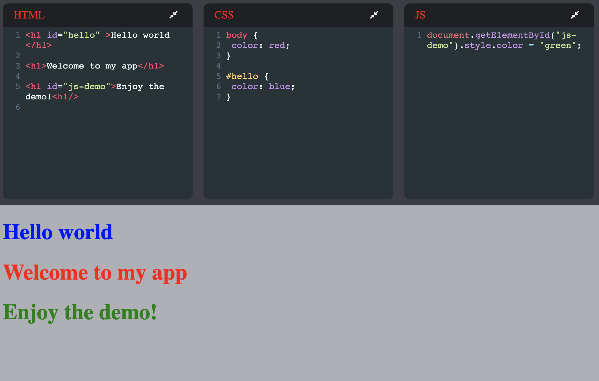

[Abstract](#CodepenClone) | [Concepts](#objective) | [How To Run](#How-To-Run) | [Screenshot](#screenshot) | [Improvements](#improvements)

# CodepenClone

A simple clone of the popular code simulator [Codepen](https://codepen.io/). It uses the [Codemirror](https://codemirror.net/) library to create editors for HTML/XML, CSS and Javascript that can be used to write code and see it render in the main window.

The app is currently hosted at [https://safe-thicket-53980.herokuapp.com](https://safe-thicket-53980.herokuapp.com) (may take a few seconds to load)

## Concepts

I created this app as a way to practice creating simple React apps. The concepts that I wanted to cover were

* [React Hooks]()
  - UseState
  - UseEffect
  - Writing custom hooks
* [Functional components]()
* Using external libraries
* Using local storage

## How To Run

Clone the repo and go to the directory \
`git@github.com:Mnargh/codepen-clone.git && cd codepen-clone`

Install dependencies \
`npm i`

Run the App on localhost:3000 \
`npm run start`

## Screenshot

## Improvements

1. Improve the styling to make the appearance more polished e.g. animate the editor collapse and expansion.

2. Make the page responsive for different screen sizes, devices

3. Add ability to save and restore code between sessions if local storage is lost
